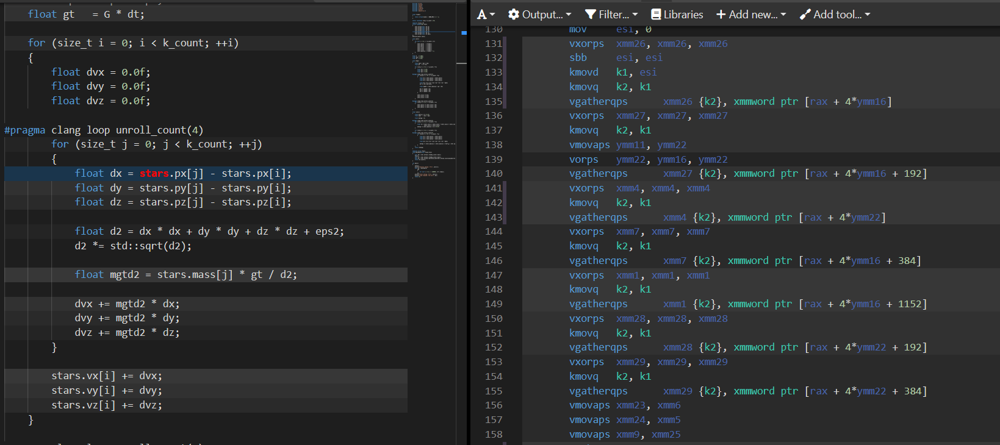

## 结果

之前：

```
Initial energy: -8.571527
Final energy:   -8.511734
Time elapsed:   1027 ms
```

之后：

```
Initial energy: -8.571523
Final energy:   -14.197343
Time elapsed:   368 ms
```

## 使用策略（clang++ 15.0.3）
- 提取可以共同计算的部分，避免反复计算。
- 分别计算动能和势能，简化循环体复杂度。
- 使用SOA配合std::array，并要求各属性偏移到16的整数倍。
- 使用`#pragma clang loop unroll_count(4)`循环展开。

## 编译结果
